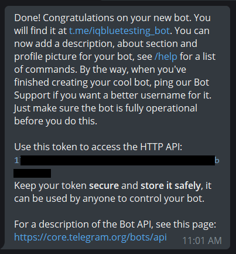
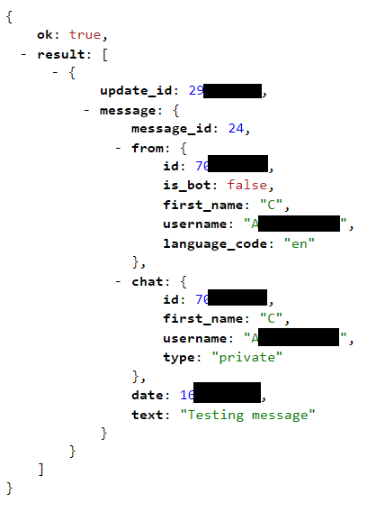
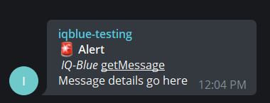
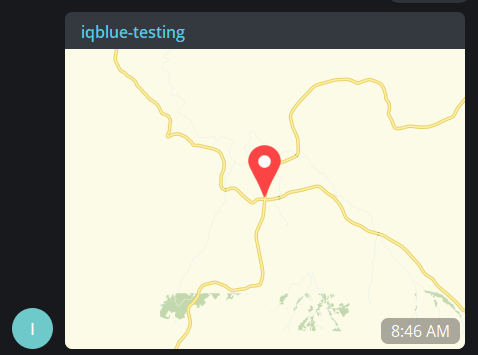

# Telegram Bot API Examples


A walk-through on how to create a telegram bot and use the `getUpdates` & `sendMessage` & `sendlocation` endpoints.

These endpoints will be displayed in a **HTTPS-interface**, **C# app**, **Python script**, **PHP script** and **JavaScript script**

Make sure you have a Telegram account (download the desktop app to make your life easier)

---

## Requirements

- Telegram app with an account.
- TOKEN: `1213232159:AFanfvdjrenfdv_MJsjesk345jfdsks`.
- Group chat id: `-43243485437`.
- A computer with internet.

# Creating a bot

[](img/botfather.png)

1. Search for the BotFather.

2. Send the message `/start` to the BotFather.

3. Send `/newbot`.

4. Give the bot a name e.g `testing_xyz`.

5. Give the bot a username `testing_xyz_bot`.

6. Now capture the HTTP API token it's very important!

[](img/bot.png)

7. Now search for the bot name `testing_xyz` and send a message to the bot contact.

# HTTPS-interface Endpoint Examples 

### _getUpdates_

[](img/updates.png)

Use this method to receive incoming updates of the bot contact using long polling. An Array of Update objects is returned.

Please note the placeholder `[token]` is replaced with the actual token.

```
https://api.telegram.org/bot[token]/getUpdates
```

|Id| Parameter  |  Mode | example values  |
| :------------| :------------ | :------------ | :------------ |
|1|`token`        |String         |1213232159:AFanfvdjrenfdv_MJsjesk345jfdsks |

|Id| Example HTTPS request  |
| :------------| :------------ |
|1| `https://api.telegram.org/bot1213232159:AFanfvdjrenfdv_MJsjesk345jfdsks/getUpdates` |

```JSON
//JSON result
{
   "ok":true,
   "result":[
      {
         "update_id":4321432,
         "message":{
            "message_id":4,
            "from":{
               "id":1234234,
               "is_bot":false,
               "first_name":"Johan",
               "username":"Johan_Doe",
               "language_code":"en"
            },
            "chat":{
               "id":1234214,
               "first_name":"Johan",
               "username":"Johan_Doe",
               "type":"private"
            },
            "date":12343242314,
            "text":"hello"
         }
      }
   ]
}
```
---

### _sendMessage_

[](img/message_icon.png)

Please note the placeholders `[token]`, `[chat_id]`, `[Text]`, `[parse_mode]` are replaced with the actual variables.

```
https://api.telegram.org/bot[token]/sendMessage?chat_id=[chat_id]&parse_mode=[parse_mode]&text=[text]
```

|Id| Parameter  |  Mode | example values  |
| :------------ | :------------ | :------------ | :------------ |
|1|`token`        |String         |1213232159:AFanfvdjrenfdv_MJsjesk345jfdsks |
|2|`chat_id`      |int            |4321432                                    |
|3|`text`         |String         |Hello+World%0ATwo                          |
|4|`parse_mode`   |String         |HTML or Markdown                           |

|Id| Example HTTPS requests |
| :------------| :------------ |
|1| `https://api.telegram.org/bot1213232159:AFanfvdjrenfdv_MJsjesk345jfdsks/sendMessage?chat_id=-4321432&text=Hello+World%0ATwo` |
|2| `https://api.telegram.org/bot1213232159:AFanfvdjrenfdv_MJsjesk345jfdsks/sendMessage?chat_id=-4321432&parse_mode=HTML&text=<b>Alert</b><i>+IQ-Blue</i><u>+getMessage</u>+%F0%9F%98%80` |
|3| `https://api.telegram.org/bot1213232159:AFanfvdjrenfdv_MJsjesk345jfdsks/sendMessage?chat_id=-4321432&parse_mode=HTML&text=%F0%9F%9A%A8+<b>Alert</b>%0A<i>+IQ-Blue</i><u>+getMessage</u>%0AMessage+details+go+here` |

Notes
- `%0A` makes a newline
- `%F0%9F%98%80` shows the siren emoji. see 
- `+` makes a space between text strings.

Examples showing emojis:
- `\xF0\x9F\x9A\xA8` format like this => `%F0%9F%9A%A8` = 😀
- `\xF0\x9F\x98\x80` format like this => `%F0%9F%98%80` = 🚨

```JSON
//JSON result
{
   "ok":true,
   "result":{
      "message_id":6,
      "from":{
         "id":1234242134,
         "is_bot":true,
         "first_name":"testing-name",
         "username":"testing-name_bot"
      },
      "chat":{
         "id":-4321432,
         "title":"testing-group",
         "type":"group",
         "all_members_are_administrators":true
      },
      "date":1234214214234,
      "text":"Hello World"
   }
}
```
---

### _sendlocation_

[](img/map.png)

Please note the variable `[token]`, `[chat_id]`, `[lat]`, `[lon]` is replaced with actual variables.

```
https://api.telegram.org/bot[token]/sendlocation?chat_id=[chat_id]&latitude=[lat]&longitude=[lon]
```

|Id| Parameter  |  Mode | example values  |
| :------------| :------------ | :------------ | :------------ |
| 1|`token`        |String         |1213232159:AFanfvdjrenfdv_MJsjesk345jfdsks |
| 2|`chat_id`      |int            |4321432                                    |
| 3|`latitude`     |String         |Hello+World%0ATwo                          |
| 4|`longitude`    |String         |HTML or Markdown                           |

|Id| Example HTTPS request  |
| :------------ | :------------ |
| 1| `https://api.telegram.org/bot1213232159:AFanfvdjrenfdv_MJsjesk345jfdsks/sendlocation?chat_id=-268086624&latitude=-29.004498&longitude=30.174663` |

```JSON
//JSON result
{
   "ok":true,
   "result":{
      "message_id":20,
      "from":{
         "id":1234214,
         "is_bot":true,
         "first_name":"testing-name",
         "username":"testing-name_bot"
      },
      "chat":{
         "id":-1234324,
         "title":"testing-group",
         "type":"group",
         "all_members_are_administrators":true
      },
      "date":1234214,
      "location":{
         "latitude":-29.004498,
         "longitude":30.174663
      }
   }
}
```

# Code Examples 

Examples using **HTTPS-interface**, **C# app**, **Python script**, **PHP script** and **JavaScript script**

https://core.telegram.org/bots/samples

## HTTPS-interface

```HTTP
https://api.telegram.org/bot1213232159:AFanfvdjrenfdv_MJsjesk345jfdsks/sendMessage?chat_id=-4321432&text=Hello+World
```

## C# app

```C#
//https://telegrambots.github.io/book/1/quickstart.html
//console app example
using System;
using System.Threading;
using Telegram.Bot;
using Telegram.Bot.Args;
using Telegram.Bot.Types;
using Telegram.Bot.Types.Enums;
using Telegram.Bot.Types.ReplyMarkups;

//https://telegrambots.github.io/book/2/send-msg/text-msg.html
namespace Telegram_Bot_CSharp
{
    class Program
    {
        static ITelegramBotClient botClient;
        static void Main(string[] args)
        {
            botClient = new TelegramBotClient("TOKEN");
            var me = botClient.GetMeAsync().Result;
            Console.WriteLine($"Hello, World! I am user {me.Id} and my name is {me.FirstName}.");
            Thread.Sleep(3000);
            botClient.OnMessage += Bot_OnMessage;
            botClient.StartReceiving();

            Console.WriteLine("Press any key to exit");
            Console.ReadKey();
            botClient.StopReceiving();
        }
        private static async void Bot_OnMessage(object sender, MessageEventArgs e)
        {
            Message message = await botClient.SendTextMessageAsync(
              chatId: e.Message.Chat, // or a chat id: 123456789
              text: "Trying *all the parameters* of `sendMessage` method",
              parseMode: ParseMode.Markdown,
              disableNotification: true,
              replyToMessageId: e.Message.MessageId,
              replyMarkup: new InlineKeyboardMarkup(InlineKeyboardButton.WithUrl(
                "Check sendMessage method",
                "https://core.telegram.org/bots/api#sendmessage"
              ))
            );
            Console.WriteLine(
            $"{message.From.FirstName} sent message {message.MessageId} " +
            $"to chat {message.Chat.Id} at {message.Date}. " +
            $"It is a reply to message {message.ReplyToMessage.MessageId} " +
            $"and has {message.Entities.Length} message entities."
            );
        }
    }
}

```

## Python script

```PY
# https://github.com/eternnoir/pyTelegramBotAPI#sending-large-text-messages
import telebot

bot = telebot.TeleBot("TOKEN")

@bot.message_handler(commands=['start', 'help'])
def send_welcome(message):
	bot.reply_to(message, "Howdy, how are you doing?")

@bot.message_handler(func=lambda message: True)
def echo_all(message):
	bot.reply_to(message, message.text)

bot.polling()
```

## PHP script

```PHP
// https://github.com/php-telegram-bot/core#send-message
$result = Request::sendMessage([
    'chat_id' => $chat_id,
    'text'    => 'Your utf8 text 😜 ...',
]);
```

## JavaScript script

```JS
//Jquery CDN <! -- -->
<script src="https://ajax.googleapis.com/ajax/libs/jquery/3.5.1/jquery.min.js"></script>

var text = 'Hello+World';
var chat_id = '-4321432';
var token = '1213232159:AFanfvdjrenfdv_MJsjesk345jfdsks';

function sendMessage(text, chat_id, token){
    $.ajax({
        type:'POST',
        url: 'https://api.telegram.org/bot' + token + '/sendMessage?chat_id=' + chat_id + '&text=' + text,
        cache:false,
         dataType:'JSONP',
        success: function(data) {
           if(data.ok == true)
           {
              alert('Success: return 0');
              console.log('Done');        
           } else 
           {
              alert('Failure: return 1');
           }
   },
        });
}
sendMessage(text, chat_id, token);
```

> JSON Formatter https://jsonformatter.curiousconcept.com/

> Telegram bot API https://core.telegram.org/bots/api

> Telegram core API https://core.telegram.org/api/entities

> Emoji unicode tables https://apps.timwhitlock.info/emoji/tables/unicode
